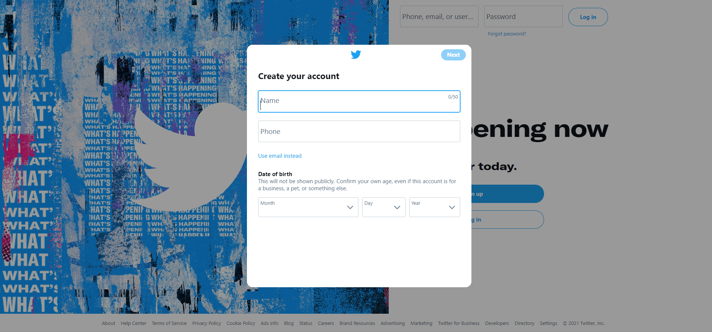
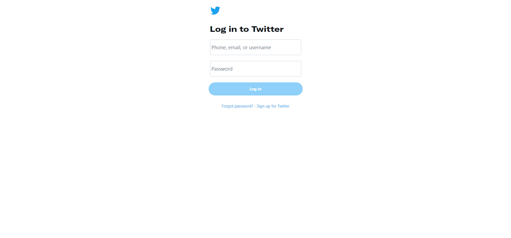
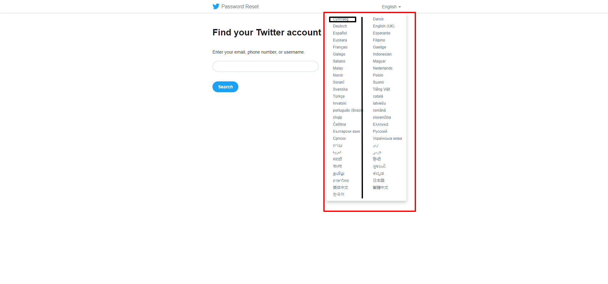
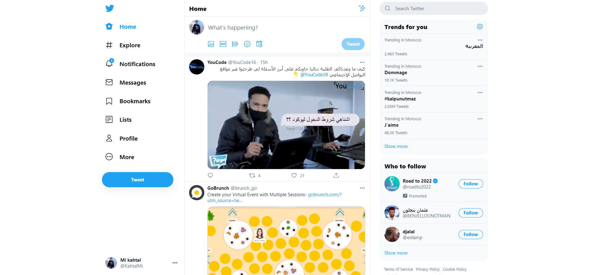
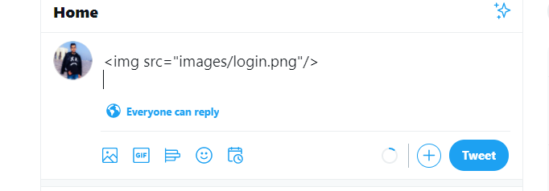

all files ,images necessary in images folder (logo, background)
 
`don't change anything with any editor image try it with code.`
 
**HINT✨:you can change the color of the SVG with css**

# what we styling :

we styling login page , full responsive

 

**note : in this section ,we using css and her technique for creating this amazing effect hover, for creating this popup login and signup search a:target selector**

 

 

_also we cloning page in login(open you account twitter and cloning content)_

 

 

**_and_**

 

 

# colors :

<ul>
<li>Primary white : #FFFFFF</li>
<li>Primary blue : rgba(29,161,242,1.00)</li>
<li>Primary blue in hover icons : rgba(29,161,242,.1)</li>
<li>like color :rgb(224, 36, 94)</li>
<li>like hover color :rgba(224, 36, 94,.1)</li>
<li>reply color :rgb(23,191,99)</li>
<li>reply hover color :rgb(23,191,99,.1)</li>
<li>Tweet button color :rgb(29, 161, 242)</li>
<li>Articles hover color :rgba(0,0,0,.03)</li>
<li>Border color :rgb(235, 238, 240)</li>
<li>Border-secondary color : rgb(196, 207, 214)</li>
<li>space between tweet box and content :rgb(247, 249, 250)</li>
<li>gray for @twitter-id :rgb(91, 112, 131)</li>
<li>input color :rgba(0, 0, 0, 0)</li>
<li>black color :rgb(15, 20, 25)</li>
<li>gray color used in trend for you:#EFF1F2</li>
<li>gray color used in hover trend for you:rgba(0,0,0,.03)</li>
<li>Number of tweet :#758696</li>
</ul>

# `NOTE : all pages full responsive`
